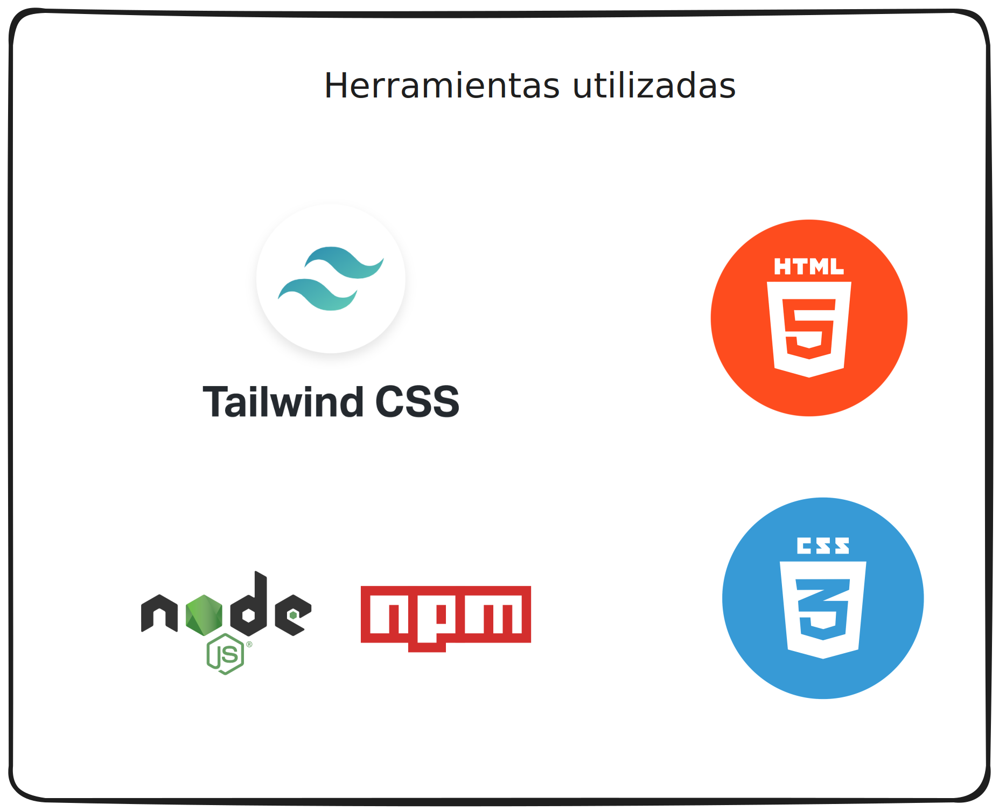
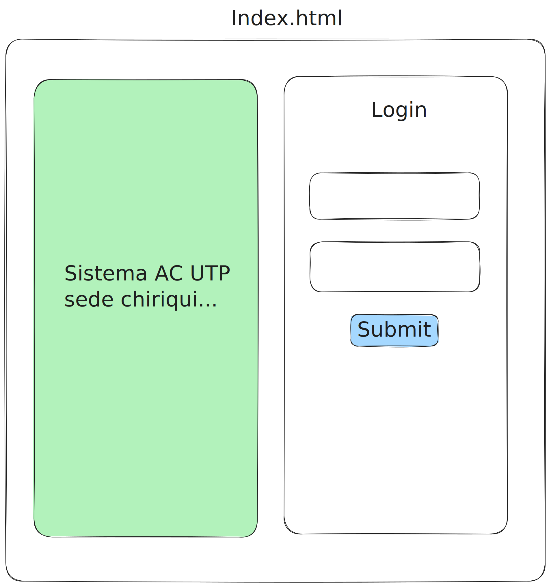
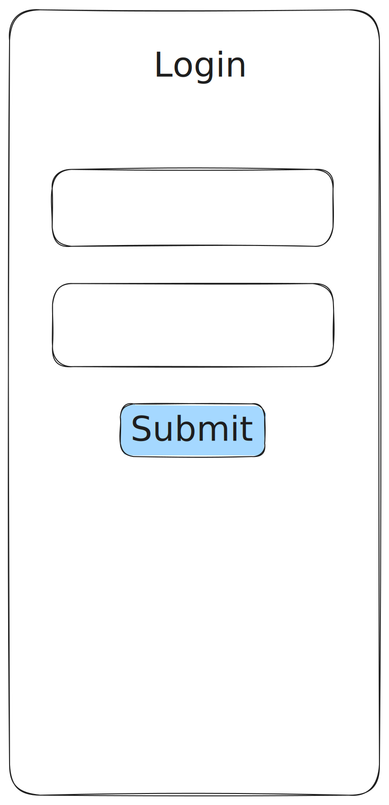
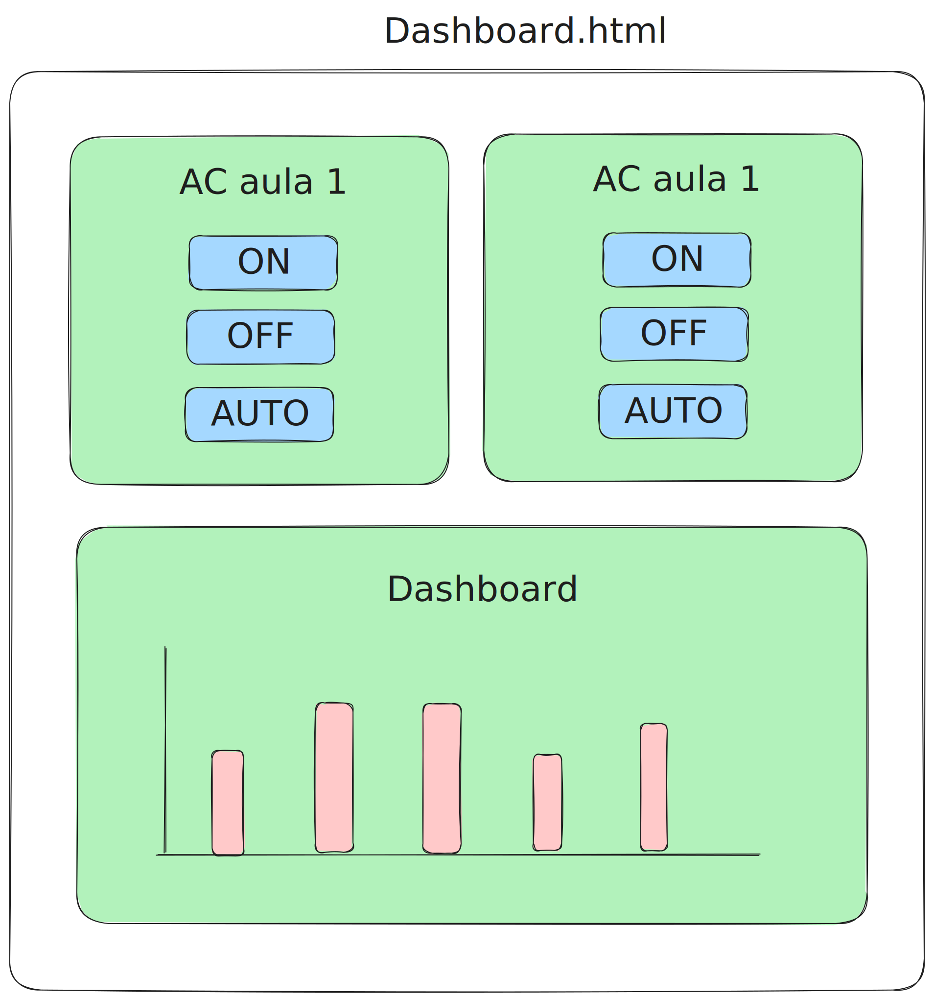
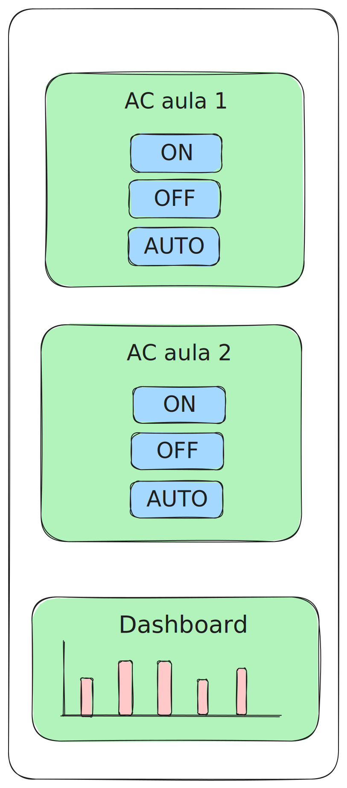

# Control de Energía en Aulas UTP - Proyecto IoT

Este proyecto tiene como objetivo desarrollar un sistema para el control de energía en las aulas de clases del Centro Regional de Chiriquí de la Universidad Tecnológica de Panamá (UTP). El sistema permitirá el encendido y apagado de aires acondicionados de forma remota a través de una aplicación móvil y una interfaz de escritorio.

## Descripción del Proyecto

El propósito principal de este proyecto es aplicar conocimientos de ingeniería de software e Internet de las cosas (IoT) para lograr un control eficiente del encendido y apagado de los aires acondicionados en las aulas de clases. Con esta solución, el personal encargado de la gestión energética podrá realizar estas tareas de manera remota, sin necesidad de desplazarse a los diferentes salones.

### Características Principales

- Encendido y apagado de aires acondicionados vía remota.
- Acceso a la aplicación desde computadoras en la garita de control y dispositivos móviles.
- Gestión eficiente de la energía en las aulas de clases.

## Materiales Utilizados

A continuación se enumeran los materiales utilizados en este proyecto:

1. **Tailwind CSS**
   - Descripción: Tailwind CSS es un marco de diseño de CSS de utilidad que facilita la creación de interfaces de usuario modernas y atractivas al proporcionar clases de estilo reutilizables.
   - Sitio web: [Tailwind CSS](https://tailwindcss.com/)

2. **Node.js**
   - Descripción: Node.js es un entorno de ejecución de JavaScript que permite desarrollar aplicaciones de servidor altamente escalables y de alto rendimiento.
   - Sitio web: [Node.js](https://nodejs.org/)

3. **HTML5**
   - Descripción: HTML5 es la última versión del lenguaje de marcado estándar utilizado para crear páginas web. Introduce nuevas características y mejoras en comparación con las versiones anteriores.
   - Documentación: [HTML5 - MDN Web Docs](https://developer.mozilla.org/es/docs/Web/HTML)

4. **CSS3**
   - Descripción: CSS3 es la última versión de la hoja de estilo en cascada (CSS), que se utiliza para aplicar estilos y diseño a páginas web. Ofrece muchas características avanzadas para la presentación web.
   - Documentación: [CSS3 - MDN Web Docs](https://developer.mozilla.org/es/docs/Web/CSS)

   

## Sketchs de las vistas

### *Vista de Login*

- #### Vista desde escritorio

   

- #### Vista desde movil

   

### *Vista del Dashboard*

- #### Vista desde escritorio

   

- #### Vista desde movil

   

## ChangeLog

| versión | cambios                |
|---------|------------------------|
| 1.0     |<ul> <li>Configuracion del proyecto y sus dependencias</li> <li>Añadido el readme.md</li> <li>Añadido la página del Login</li> </ul> |
| 2.0     |<ul> <li>Edición del readme para agregar diagramas e imágenes</li> <li>Edición del .gitignore</li> <li>Añadido el comando para minificar el css para releases</li> <li>Edición de los estilos en el index</li> <li>Refactorización del index</li> <li>Construcción de los estilos de tailwind para producción</li> </ul>|
| 3.1.1   |<ul> <li>Añadida js para manejar la autenticación de usuarios</li> <li>Solución de bug de validación a través de petición a la API</li> <li>Añadido dashboard responsive</li> <li>Añadido función de autenticación de usuarios</li> <li>Solución de conflictos en los estilos</li> <li>Solución de bugs con el link del css en el index</li> <li>Añadido changelog en el readme</li> </ul> |
